## 联系方式

- 博客: [www.xuanmo.xin](https://www.xuanmo.xin)
- QQ: 993901865
- 微信：D-xuanmo
- Email：me@xuanmo.xin
- Twitter：[Xuanmo](https://twitter.com/Xuanmo_d)

## 摸鱼动态

## 技术栈
|End|Stack|
|---|---|
|Language|   |
|FrontEnd|    |
|BackEnd|   |
|OS| |
|CI/CD|  |
